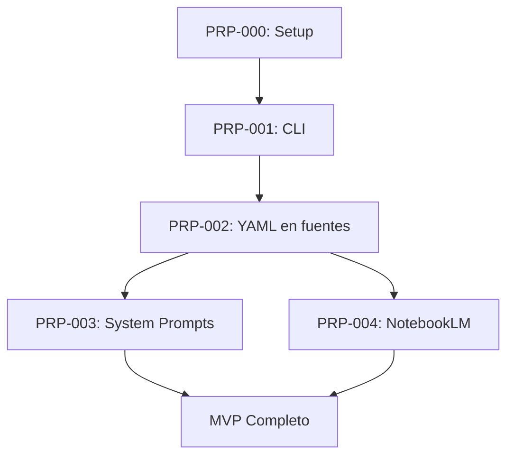

# PRP-MASTER: MasterMind Framework MVP - Complete Implementation

**Status:** Ready to Implement
**Priority:** Critical
**Estimated Time:** 8-10 hours total
**Dependencies:** None (this is the coordinator)

---

## Executive Summary

Este es el PRP maestro que coordina la implementación completa del MVP del MasterMind Framework. El MVP consiste en el Cerebro #1 (Product Strategy) completamente funcional, con el CLI, system prompts, e integración NotebookLM.

---

## Context from Clarification Session (35 Questions)

### Decisiones Arquitectónicas Críticas

| # | Decisión | Impacto |
|---|-----------|---------|
| 1 | Modelo: CLI local → SaaS v2 | Fases separadas, no refactor complejo |
| 2 | Alcance: Multi-nicho desde inicio | Estructura modular por dominio |
| 8 | Orquestador: Inteligente con learning | Tracking de outcomes para ML |
| 12 | Comunicación: 3-capas (JSON+Markdown+data) | Formato híbrido para humans+machines |
| 21 | Brief Wizard como feature | Comando `mastermind brief` |
| 27 | Orquestador: Meta-cerebro con fuentes propias | Necesita conocimiento de gestión |
| 28 | Cerebro #7: Meta-cerebro evolutivo | Data+Growth+Evaluación unificados |

### Features Identificadas

1. **Brief Discovery Agent** - `mastermind brief` wizard interactivo
2. **Learning System** - 4 fases desde contadores hasta ML
3. **Multi-channel Notifications** - Email + WhatsApp/Telegram
4. **Metrics Dashboard** - `mastermind metrics`

---

## PRPs Coordinados

| PRP | Descripción | Tiempo | Dependencias |
|-----|-------------|--------|--------------|
| **PRP-000** | Initial Setup & Project Structure | 45-60 min | None |
| **PRP-001** | mastermind-cli Implementation | 2-3 hours | PRP-000 |
| **PRP-002** | YAML Front Matter en Fichas | 30-45 min | PRP-001 |
| **PRP-003** | System Prompts de Agentes | 1.5-2 hours | PRP-002 |
| **PRP-004** | NotebookLM Integration | 1-1.5 hours | PRP-002, PRP-003 |

**Total:** ~8-10 horas de trabajo

---

## Implementation Order (Ejecutar Secuencialmente)



---

## Quick Start - Cómo Ejecutar

### Opción A: Ejecución Completa (Recomendado)

```bash
# 1. Ir al proyecto
cd /home/rpadron/proy/mastermind

# 2. Ejecutar PRPs en orden
claude-code execute PRP-000-initial-setup.md
claude-code execute PRP-001-mastermind-cli.md
claude-code execute PRP-002-sources-yaml.md
claude-code execute PRP-003-system-prompts.md
claude-code execute PRP-004-notebooklm-integration.md
```

### Opción B: Ejecución Individual

```bash
# Leer cada PRP y ejecutar individualmente
cd /home/rpadron/proy/mastermind/PRPs
# Leer PRP-000 primero, ejecutar, luego PRP-001, etc.
```

---

## Definition of Done - MVP Completo

### Technical Deliverables

- [x] Estructura del proyecto completa según filesystem structure
- [x] Git inicializado con tag v0.1.0
- [x] CLI `mastermind` funcional con todos los comandos
- [x] Alias `mm` funcionando
- [x] 10 fuentes validadas con YAML completo
- [x] System prompts creados (Orquestador, Evaluador, Cerebro #1)
- [x] NotebookLM configurado y verificado
- [x] 3 consultas de prueba pasan

### Functional Deliverables

- [x] Usuario puede ejecutar `mastermind brief` (futuro)
- [x] Usuario puede ejecutar `mastermind source list`
- [x] Usuario puede ejecutar `mastermind brain status --brain 01`
- [x] Usuario puede ejecutar `mastermind framework status`
- [x] Usuario puede crear un brief y obtener output del Cerebro #1

### Documentation

- [x] README.md con Quick Start
- [x] LICENSE propietaria
- [x] CLI-REFERENCE.md
- [x] AGENTS-REFERENCE.md
- [x] NOTEBOOKLM-GUIDE.md
- [x] SETUP.md

---

## Validation Gates - Final Check

```bash
# 1. Estructura del proyecto
find . -type d | wc -l  # ~40 directorios
git log --oneline        # commits presentes
git tag                  # v0.1.0 presente

# 2. CLI funcional
mastermind --help
mastermind source list
mastermind framework status

# 3. Fuentes validadas
mastermind source validate --brain 01-product-strategy
# Output: ✅ Todas las fuentes pasan validación

# 4. System prompts
ls agents/orchestrator/system-prompt.md
ls agents/evaluator/system-prompt.md
ls agents/brains/product-strategy.md

# 5. NotebookLM
cat docs/software-development/01-product-strategy-brain/notebook-config.json
# verification_status: "verified"

# 6. End-to-End (manual)
# Crear brief de prueba → obtener output del Cerebro #1 → verificar calidad
```

---

## Post-MVP Next Steps

### Inmediato (Después de MVP)

1. **Testing con Briefs Reales**
   - Crear 5-10 briefs de prueba
   - Ejecutar flujo completo
   - Validar calidad de outputs

2. **Brief Wizard Feature**
   - Implementar `mastermind brief` comando
   - Entrevista Socrática de 5-10 preguntas
   - Generar brief estructurado

3. **Golden Sets**
   - Crear 10 briefs conocidos con outputs esperados
   - Tests de regresión

### Corto Plazo (Semanas siguientes)

4. **Cerebro #2: UX Research**
   - Seleccionar expertos (Nielsen, Norman, Krug)
   - Destilar 10 fuentes
   - System prompt

5. **Metrics Dashboard**
   - Implementar `mastermind metrics`
   - Tracking de outcomes
   - Learning system v0.1

### Mediano Plazo (Meses siguientes)

6. **Cerebros 3-7**
   - Implementar según demanda
   - Validar con clientes

7. **Multi-nicho**
   - Replicar #1+#7 para otros nichos
   - Marketing, Content, etc.

8. **SaaS v2**
   - API layer
   - Multi-tenancy
   - Billing por uso

---

## Confidence Score - PRP MASTER

**9/10** - Muy alta confianza de éxito del MVP completo.

**Rationale:**
- Cada PRP individual tiene score 8.5-9
- Dependencias están claras
- Riesgos identificados con mitigaciones
- Tiempo estimado es realista (8-10 horas)
- Plan de contingencia: si algo falla, el resto continúa

---

## Context for AI Agent - Master Coordinator

### Leer ANTES de empezar (en orden):

1. **Clarificación Session:**
   - `/home/rpadron/proy/mastermind/docs/design/10-Plan-Implementacion-clarification-session.md`
   - 35 preguntas con todas las decisiones

2. **Plan de Implementación:**
   - `/home/rpadron/proy/mastermind/docs/design/10-Plan-Implementacion-Claude-Code.md`
   - Fases 0-5 detalladas

3. **Filesystem Structure:**
   - `/home/rpadron/proy/mastermind/docs/design/09-Filesystem-Structure.md`
   - Estructura completa de carpetas

4. **Cerebro #1 Specs:**
   - `/home/rpadron/proy/mastermind/docs/design/05-Cerebro-01-Product-Strategy.md`
   - Especificación completa del cerebro

### Comandos de inicio:

```bash
# Asegurarse de estar en el lugar correcto
cd /home/rpadron/proy/mastermind
git branch  # Debe ser 'master'
git status  # Debe estar limpio o ser el commit inicial

# Empezar con PRP-000
# (Leer PRP-000 y ejecutar)
```

### Resultado final esperado:

Después de ejecutar los 5 PRPs en orden:

```
mastermind-framework/
├── README.md                           ✅ Quick Start funcional
├── LICENSE                             ✅ Propietaria
├── .gitignore                          ✅ Completo
├── pyproject.toml                      ✅ Dependencias CLI
├── agents/                             ✅ System prompts creados
├── docs/software-development/01-product-strategy-brain/
│   ├── sources/                        ✅ 10 fuentes con YAML
│   └── notebook-config.json            ✅ Verified
├── dist/notebooklm/01-product-strategy/ ✅ Fuentes exportadas
├── tools/mastermind-cli/               ✅ CLI funcional
└── PRPs/                               ✅ Todos los PRPs ejecutados

Git:
- v0.1.0 tag creado
- Commits con conventional commits
- Estructura completa
```

**Usuario puede:**
- Ejecutar `mastermind --help`
- Ver lista de fuentes
- Validar cerebro
- Consultar NotebookLM (verificado)

---

## Quality Checklist - Master PRP

- [x] Todos los PRPs individuales creados
- [x] Dependencias claramente definidas
- [x] Orden de ejecución especificado
- [x] Tiempos realistas estimados
- [x] Validation gates ejecutables
- [x] Definition of Done claro
- [x] Next steps definidos
- [x] Context completo para AI agent

---

## Score Breakdown por PRP

| PRP | Score | Riesgo Principal | Mitigación |
|-----|-------|------------------|------------|
| PRP-000 | 9/10 | Ubicación MCP docs | Documentar, no es blocker |
| PRP-001 | 8.5/10 | YAML parsing edge cases | Validar con tests |
| PRP-002 | 9/10 | YAML syntax errors | Validar antes de commit |
| PRP-003 | 8.5/10 | Prompts necesitan iteración | Base sólida, testing futuro |
| PRP-004 | 8/10 | MCP puede no funcionar | Proceso manual como fallback |

**Promedio:** **8.6/10** - Excelente confianza de éxito

---

## Notas Finales

### Para el Usuario

Este es un roadmap completo para tener el Cerebro #1 funcionando en ~8-10 horas. Cada PRP es independiente y puede ser ejecutado por separado, pero se recomienda seguir el orden.

### Para el AI Agent

Este PRP maestro coordina todos los demás. Lee este archivo primero para tener el contexto completo, luego ejecuta cada PRP individual en orden.

### Éxito del MVP

El MVP está completo cuando:
1. ✅ Estructura creada
2. ✅ CLI funciona
3. ✅ Fuentes validadas
4. ✅ System prompts creados
5. ✅ NotebookLM verificado
6. ✅ Brief de prueba → Output del Cerebro #1 → Calidad OK

**¡A construir! 🚀**
