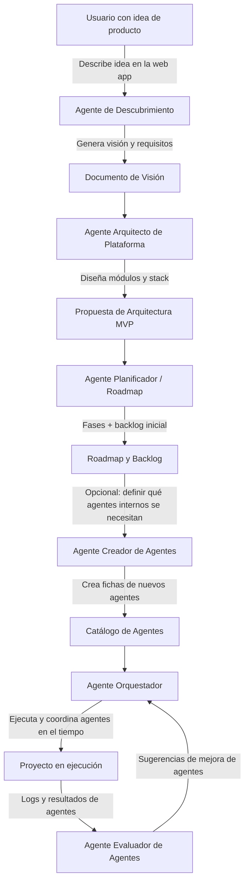
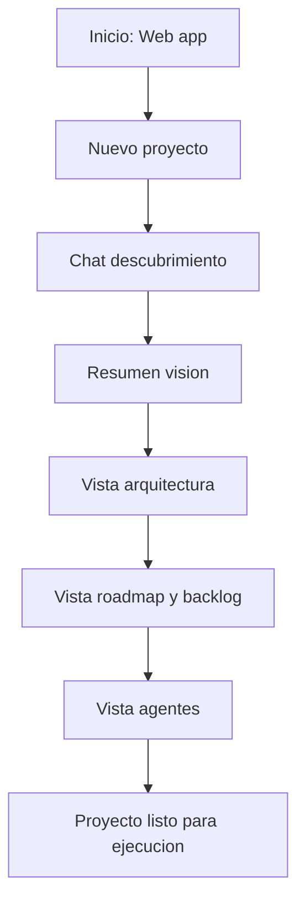

# Panorama competitivo para una plataforma de agentes empresariales multi‑canal en LATAM

## 1. Resumen ejecutivo

En 2026 ya existe una ola fuerte de soluciones de “agentes con IA” para atención al cliente, ventas y automatización, tanto globales (Zendesk, Intercom, Forethought, Talkdesk, NICE, Boost.ai, Twilio, Ada, etc.) como regionales en LATAM (Agentify, Treble, Oversai, CRMs locales y múltiples plataformas de chatbot para WhatsApp).  Sin embargo, la mayoría se centra en uno o dos agentes por caso de uso (bot conversacional, calificador de leads, copilot), no en “grupos de agentes” que analicen procesos de negocio de punta a punta y propongan mejoras de forma orquestada.[^1][^2][^3][^4][^5][^6][^7][^8][^9][^10][^11][^12]

Para diferenciar una plataforma nueva de “grupos de agentes empresariales” enfocados en LATAM, los ejes clave son: (1) diagnóstico y rediseño de procesos de negocio, no solo chat; (2) orquestación multi‑agente real (ventas, soporte, operaciones, reporting) sobre múltiples canales (WhatsApp, redes, email, web); (3) foco fuerte en español/portugués, cumplimiento y privacidad; y (4) experiencia de implementación simple tipo “consultoría + producto”, que hoy suele ser un dolor con muchas soluciones existentes.[^13][^3][^5][^6][^8]

## 2. Tendencias del mercado (global y LATAM)

### 2.1. Agentic AI y multi‑agente en customer service

Varios proveedores grandes ya hablan explícitamente de “agentic AI” y orquestación de múltiples agentes para automatizar flujos complejos de servicio al cliente de punta a punta.  Talkdesk describe una plataforma de “multi‑agent orchestration” donde agentes especializados se coordinan para manejar procesos como cambios de itinerario, reembolsos y notificaciones proactivas en múltiples canales.  NICE y Boost.ai también enfatizan agentes que planifican y ejecutan flujos multi‑paso, tomando decisiones dentro de políticas definidas en lugar de ser simples chatbots de FAQ.[^2][^3][^4][^5]

Además, plataformas como Forethought estructuran el producto como un conjunto de agentes especializados (Solve para automatizar cara al cliente, Triage para enrutar, Assist para copilot, Discover para insights), lo que respalda la idea de arquitecturas multi‑agente especializadas.  Zendesk e Intercom están añadiendo capacidades de “AI Agents” y copilots, integrados en sus helpdesks omnicanal, aunque usualmente como pocas entidades lógicas configurables, no como “pods” ricos de agentes colaborando entre sí.[^14][^7][^9][^15]

### 2.2. WhatsApp y canales móviles como columna vertebral en LATAM

En LATAM la atención por WhatsApp es crítica, y muchos players ya se posicionan específicamente en torno a “agentes de IA para WhatsApp Business”, con foco en ventas, soporte y automatización.  Twilio publica guías de cómo usar IA con WhatsApp para responder rápido, automatizar estados de pedido, reservas y actualizar horarios, destacando beneficios de productividad y reducción de errores.  Plataformas como ChatbotWhatsApp.com ofrecen chatbots de IA que califican leads, responden preguntas frecuentes y cierran ventas en WhatsApp 24/7 para empresas.[^16][^6][^8][^10]

También aparecen soluciones con enfoque regional que combinan CRM + WhatsApp + IA conversacional (por ejemplo, un CRM líder en Colombia/LATAM con agentes para calificación, predicción y conversaciones por WhatsApp, email y chat) para ventas y soporte en español.  Esto confirma que el mercado ya espera integraciones nativas con WhatsApp Business API, otros canales sociales y herramientas de negocio como requisito básico.[^6]

### 2.3. Ola de iniciativas específicas para LATAM

Surgen también iniciativas de modelos y agentes de IA orientados a la región, como Latam-GPT, un modelo de lenguaje generativo abierto diseñado para Latinoamérica, lo que muestra interés en soluciones con identidad regional y sensibilidad a contexto cultural e idiomático.  A nivel de producto, varios players de automatización con IA se declaran basados en Montevideo, Colombia u otros países de la región, con mensajes claros de “soporte local en español” y adaptación a necesidades de negocios latinoamericanos.[^17][^11][^1][^6]

Esto abre una oportunidad para posicionar una plataforma de agentes multi‑disciplina como “nativa de LATAM”: lenguaje, regulaciones, casos de uso, plantillas y mejores prácticas de la región, en vez de ser simplemente una capa más sobre herramientas globales.

## 3. Competidores relevantes en el mercado latinoamericano

### 3.1. Agentify (Uruguay)

Agentify, con base en Montevideo, se presenta como una solución de “agentes con IA para tu fuerza de trabajo” que automatiza la atención comercial y se integra con WhatsApp, Instagram, Facebook, LinkedIn y email en un solo flujo.  Prometen atención automática 24/7, calificación de oportunidades y ejecución de tareas repetitivas manteniendo el tono de la marca, posicionándose claramente en el segmento de pymes y negocios que quieren centralizar mensajería y automatizar respuestas.[^1]

Sus términos y políticas indican que sus agentes pueden mantener conversaciones, acceder a bases de datos de productos, crear publicaciones para redes sociales y realizar funciones administrativas, además de gestionar bases de datos y automatizaciones sobre varias plataformas.  Esto implica que su propuesta combina chatbot omnicanal, cierta automatización operativa y contenido para social media, sin un componente explícito de “evaluación profunda de procesos de negocio” o grupos de agentes especializados por dominio.[^18][^19]

### 3.2. Agentify AI / CondoBuddy (automatización para condominios)

Agentify AI (sitio separado orientado a "CondoBuddy") ofrece automatización con agentes inteligentes centrados en WhatsApp Business para gestión de condominios, con diagnóstico de procesos, diseño de flujos lógicos y conexión a sistemas de gestión.  Su enfoque está más verticalizado (propiedad horizontal / property management), con agentes que manejan tareas como mantenimiento, comunicación con residentes y coordinación de operaciones.[^20][^13]

Esta línea muestra un patrón interesante: usar agentes de IA como capa de automatización especializada por industria, no como plataforma horizontal para cualquier tipo de negocio. Para una nueva propuesta, se puede tomar este enfoque vertical como inspiración, pero diseñando el core del producto para ser adaptable a múltiples industrias desde el inicio.

### 3.3. Plataformas omnicanal de WhatsApp con IA (Oversai, Treble, otros)

Oversai se posiciona como una plataforma omnicanal centralizada para WhatsApp, con soporte para múltiples cuentas, escalabilidad y “agentes de IA integrados para WhatsApp” que atienden 24/7 y transfieren a humanos cuando es necesario.  Su mensaje se centra en gestión unificada de WhatsApp, agentes de IA y automatización para empresas mobile‑first, reforzando la idea de que el canal estrella en LATAM ya tiene jugadores sólidos.[^11]

Treble.ai se comercializa como una plataforma de marketing en WhatsApp, donde se pueden desplegar agentes de IA para manejar mensajes y ejecutar campañas, integrándose con herramientas de negocio para impulsar resultados comerciales.  Aunque no toda su propuesta es “agentic”, sí demuestra que la combinación WhatsApp + IA + automatización de embudos de ventas es casi un estándar de mercado.[^12]

### 3.4. CRMs y suites LATAM con agentes de IA

Existen CRMs orientados a Colombia y LATAM que incluyen “IA conversacional” en español, integración nativa con WhatsApp Business, análisis predictivo, workflows inteligentes y soporte local.  Estos productos ofrecen agentes de calificación, agentes predictivos, agentes conversacionales y agentes de personalización, todos enfocados en ventas y retención de clientes.[^6]

Este tipo de soluciones mezcla CRM, automatización de marketing y agentes de IA especializados, ofreciendo un panel integrado para equipos comerciales. Para un nuevo jugador, implica que la integración con CRMs populares (y quizás con estos CRMs locales) será clave si se quiere participar del mismo espacio competitivo.

### 3.5. Puros chatbots de WhatsApp con IA

Además, hay plataformas centradas en habilitar “chatbots de WhatsApp con IA” para calificar leads, responder FAQs y cerrar ventas 24/7, sin necesariamente ofrecer una capa rica de orquestación multi‑agente o evaluación global del negocio.  Muchos de estos players se posicionan con mensajes de facilidad (“sin código”), plantillas y foco en reducir carga operativa de soporte.[^10][^16]

Estas soluciones son competidores parciales: resuelven el frente de mensajería y atención básica, pero dejan espacio para un producto más sofisticado que combine ese frente conversacional con análisis de procesos, KPIs de negocio y automatización back‑office.

## 4. Competidores globales relevantes

### 4.1. Zendesk AI, Intercom Fin, Ada, Forethought

Zendesk y Intercom han incorporado agentes de IA que responden directamente a clientes, actúan como copilots para agentes humanos y ofrecen capacidades de voz para soporte telefónico.  Pueden entrenarse con bases de conocimiento, sitios web y contenido interno, responder en múltiples idiomas y gestionar handoff a humanos dentro de sus plataformas de helpdesk.[^14]

Intercom Fin AI enfatiza resolución autónoma end‑to‑end desde la base de conocimiento, con pricing por resolución y soporte para canales como chat, email, API, WhatsApp, Messenger y voz, además de integrarse de forma nativa con Zendesk en algunos escenarios.  Ada se posiciona como plataforma nativa de automatización de servicio con altas tasas de resolución y enfoque “automation‑first”, mientras que Forethought ofrece un stack de agentes especializados (Solve, Triage, Assist, Discover) integrado con Zendesk, Salesforce, Freshdesk y ServiceNow.[^7][^14]

### 4.2. Talkdesk, NICE y Boost.ai (agentic / multi‑agent orchestration)

Talkdesk promueve una plataforma de orquestación multi‑agente que automatiza workflows complejos de servicio al cliente, con agentes especializados que coordinan tareas como gestión de interrupciones de viaje, cambios de itinerario, reembolsos y notificaciones proactivas a través de canales digitales.  Su enfoque está en coordinar acciones entre front y back office, integrando sistemas de facturación, fidelización y comunicación.[^3]

NICE describe su “Agentic AI” como un conjunto de capacidades para manejar solicitudes complejas multi‑paso, priorizar casos según impacto, automatizar flujos que cruzan múltiples sistemas, mantener contexto entre canales y aprender continuamente de resultados y señales operativas.  Boost.ai, por su parte, destaca la gestión de múltiples agentes en una misma instancia, con handoffs fluidos entre ellos para cumplir necesidades del usuario.[^5][^2]

### 4.3. Twilio, Qiscus y frameworks de automatización

Twilio ofrece infraestructura y guías para usar IA en WhatsApp, automatizando etapas del customer journey como seguimiento de pedidos, reservas y actualización de horarios, con foco en reducción de errores, aumento de productividad y escalamiento de atención.  Herramientas como Qiscus muestran cómo un enfoque de plataforma multicanal permite desplegar chatbots de IA como primera línea de respuesta, con handoff a humanos, integración con CRMs y dashboards en tiempo real de métricas de atención.[^21][^8]

Plataformas de automatización general como n8n ya tienen workflows listos para asistentes de soporte al cliente por WhatsApp que mapean automáticamente el contenido de un sitio web, responden en tiempo real y permiten cambiar de canal (WhatsApp, Telegram, Slack, web chat) con pocas modificaciones.  Esto indica que parte del mercado se está resolviendo via orquestación low‑code y no solo con SaaS puros de customer support.[^22]

## 5. Dolor actual de las empresas y limitaciones de la competencia

### 5.1. Dolor de las empresas (especialmente en LATAM)

Los dolores más frecuentes que se observan en propuestas y casos de uso son:

- Dependencia excesiva de humanos para atención repetitiva: soportes saturados respondiendo siempre las mismas preguntas, lo que motivó la creación de asistentes de IA para WhatsApp y otros canales.[^23][^8][^10]
- Desorden de canales: empresas que atienden por WhatsApp, Instagram, Facebook, email y sitio web sin una bandeja unificada ni automatizaciones robustas.[^11][^12][^1]
- Falta de datos accionables: muchas soluciones ofrecen chatbots, pero no generan insights claros para optimizar procesos o priorizar acciones (por ejemplo, cuáles flujos realmente ahorran dinero o tiempo al negocio).[^21][^6]
- Implementación complicada: trabajar directamente con la API de WhatsApp Business puede ser complejo, por lo que se recomiendan proveedores oficiales (Meta Tech Providers) que simplifiquen la configuración y el cumplimiento.[^16]
- Escalabilidad limitada: se necesitan soluciones que atiendan 24/7, en varios idiomas y canales, manteniendo contexto y personalización, algo que plataformas de agentic AI intentan resolver pero que aún requiere esfuerzos de integración significativos.[^4][^3][^5]

### 5.2. Limitaciones y brechas en soluciones actuales

A partir de las descripciones de productos y casos de uso, aparecen varias brechas donde una plataforma nueva puede diferenciarse:

- **Poca orientación a diagnóstico integral de negocio:** la mayoría de soluciones se centran en atención, marketing y ventas (frente al cliente), mientras los procesos internos (operaciones, finanzas, back office) quedan fuera del alcance principal del agente.[^10][^1][^6]
- **Arquitecturas multi‑agente poco visibles al cliente final:** aunque algunos proveedores hablan de orquestación multi‑agente, la experiencia de usuario suele exponer solo “un bot” por canal, sin una metáfora clara de equipo de agentes especializados que el cliente pueda entender o configurar.[^3][^5][^7]
- **Falta de consultoría embebida:** muchas herramientas son poderosas pero requieren que el cliente tenga equipo técnico o consultores externos para diseñar flujos, prompts y procesos; pocas combinan producto + servicio para mapear procesos, identificar “dolores” y proponer automatizaciones de forma guiada.[^13][^16]
- **Cumplimiento y privacidad genéricos:** los líderes globales destacan certificaciones fuertes (SOC 2, ISO, GDPR, CCPA, HIPAA), pero esto suele estar pensado para mercados de EEUU/Europa; en LATAM las empresas a veces necesitan interpretaciones específicas (ej. Ley de Protección de Datos Personales local) y garantías contractuales claras.[^5][^7]
- **Latinoamérica como “afterthought”:** muchas suites ofrecen soporte en español, pero no necesariamente adaptan UX, plantillas, casos de uso y precios al contexto de pymes latinoamericanas.[^1][^6]

## 6. Funcionalidades mínimas a igualar

### 6.1. Capas conversacionales y multi‑canal

Una nueva plataforma debería, como mínimo, igualar la capacidad de:

- Conectar y unificar WhatsApp Business API, Instagram, Facebook, email y, idealmente, webchat y otros canales relevantes (Telegram, Messenger), como ya hacen Agentify, Oversai, Qiscus y varios CRMs LATAM.[^21][^6][^11][^1]
- Ofrecer agentes de IA conversacionales en español/portugués que manejen FAQs, califiquen leads, cierren ventas simples y hagan handoff fluido a humanos, con bandeja unificada para equipos.[^6][^10][^1]
- Permitir personalizar tono de voz, idioma y reglas de escalamiento, como ofrecen plataformas de helpdesk modernas y flujos configurables (n8n, Qiscus, Intercom, Zendesk).[^22][^14][^21]

### 6.2. Integración con ecosistema de negocio

Funcionalidades base a igualar incluyen:

- Integraciones con CRMs, plataformas de e‑commerce y sistemas de negocio (Shopify, WooCommerce, Stripe, etc.) para consultar órdenes, actualizar estados de pedidos y registrar interacciones de clientes.[^7][^22][^21]
- Dashboards en tiempo real de métricas de atención (tiempos de respuesta, resolución, volumen por canal, desempeño de agentes humanos y de IA), como ya ofrecen Qiscus y suites de servicio al cliente.[^9][^21]
- Workflows automatizados: campañas de marketing, secuencias de seguimiento, recordatorios de citas, calificación de leads y acciones post‑interacción (encuestas, NPS, etc.).[^12][^10][^6]

### 6.3. Seguridad, cumplimiento y privacidad

Aunque un producto nuevo aún no tenga todas las certificaciones de un Intercom o Zendesk, debería desde el inicio:

- Definir claramente manejo de datos, acceso a bases internas y logs de conversación, tomando como referencia plataformas que destacan certificaciones como SOC 2, ISO 27001, ISO 42001, GDPR, CCPA y HIPAA.[^5][^7]
- Ofrecer mecanismos de control de acceso por rol, entornos separados por cliente, cifrado en tránsito y en reposo, y opciones de retención/borrado de datos.[^7][^5]
- Documentar cómo se evita el “hallucination” y se mantiene trazabilidad de acciones de agentes, dado que algunos proveedores ya publican métricas de alucinación muy bajas y guardrails de políticas.[^5][^7]

## 7. Funcionalidades diferenciales para sobresalir

### 7.1. Orquestación visible de grupos de agentes

Para llevar la idea de “grupos de agentes multidisciplinarios” a producto, una oportunidad clara es hacer visible y configurable la orquestación:

- Definir agentes especializados (por ejemplo: Diagnóstico de Negocio, Ventas, Soporte, Operaciones, Finanzas/Reporting) que colaboran entre sí en cada caso de uso, inspirándose en arquitecturas multi‑agente pero con UX sencilla.[^2][^3][^7]
- Permitir que el usuario vea qué agente está actuando en cada paso (ej. “Agente de Diagnóstico analizando tu embudo”, “Agente de Soporte proponiendo flujos de automatización”), creando una narrativa de “equipo virtual”.[^3][^5]
- Incorporar plantillas de “pods de agentes” por industria (retail, educación, salud, inmobiliario, servicios profesionales) que combinen varios agentes y flujos preconfigurados.

### 7.2. Módulo de diagnóstico y rediseño de procesos

Otra gran brecha es ir más allá del chat y ofrecer diagnóstico de procesos de negocio:

- Agentes que analicen conversaciones históricas, tickets, métricas de atención y datos de negocio para identificar cuellos de botella, tareas repetitivas y oportunidades de automatización (por ejemplo, reportes automáticos de “top 10 motivos de contacto” y sugerencias de flujos).[^9][^21][^6]
- Flujos guiados tipo consultoría: el sistema pregunta al usuario sobre su proceso actual (ventas, soporte, operaciones), genera un mapa simple de proceso y propone qué partes automatizar con agentes, generando los flujos/bots iniciales casi automáticamente.[^13][^16]
- Recomendaciones continuas (“agentic optimization”): agentes que monitorean KPIs y proponen ajustes de flujos cuando detectan baja resolución, tiempos altos o quejas recurrentes.

### 7.3. Experiencia “producto + consultoría” enfocada en LATAM

Muchas empresas en LATAM valoran la mano‑a‑mano más que una herramienta autoservicio compleja:

- Ofrecer paquetes que incluyan discovery, mapeo de procesos, diseño inicial de flujos y entrenamiento a equipos, apoyándose en agentes internos que aceleran el trabajo de consultores humanos.[^16][^13]
- Plantillas y casos de uso específicos de la región (recaudo, medios de pago locales, logística en ciudades con alta informalidad, soporte posventa en sectores como educación en línea, turismo local, retail físico, etc.).[^8][^6]
- Soporte en español/portugués, con ejemplos de contratos y documentación alineados a regulaciones de protección de datos de países clave.

### 7.4. Modelo flexible de despliegue y compliance

Como ventaja competitiva frente a SaaS puramente cloud:

- Diseñar arquitectura preparada para entornos híbridos (por ejemplo, procesamiento de datos sensibles on‑prem o en VPC del cliente, con orquestación desde la nube).[^5]
- Dar opciones de control sobre qué datos se usan para entrenar modelos, almacenaje de logs y anonimización, lo cual puede ser un diferenciador fuerte para banca, salud y gobierno en LATAM.[^7][^5]

## 8. Conclusiones accionables para la idea

El mercado ya valida la demanda por agentes de IA para atención y automatización sobre WhatsApp y canales digitales, y los líderes globales empujan arquitecturas multi‑agente y agentic AI, pero aún hay espacio para una plataforma que combine tres cosas: foco en LATAM, grupos de agentes empresariales multi‑disciplina y fuerte orientación a diagnóstico y optimización de procesos de negocio.[^1][^3][^6][^5]

Para avanzar, la recomendación es: (1) definir 2–3 verticales iniciales (por ejemplo: servicios profesionales, educación, inmobiliario) y diseñar pods de agentes específicos para cada una; (2) construir desde el inicio una capa de diagnóstico de procesos y recomendaciones automáticas; y (3) diseñar la propuesta de valor y pricing como “producto + consultoría ligera”, apoyándose en agentes internos para reducir costo de servicio, de modo que la oferta sea muy atractiva para empresas latinoamericanas que hoy se sienten abrumadas por herramientas complejas o demasiado genéricas.[^13][^16][^6]

---

## References

1. [Agentify | Agentes con AI para tu fuerza de trabajo.](https://www.agentify.uy) - Estamos basados en Montevideo, Uruguay. Desarrollamos automatizaciones con AI que se integran con to...

2. [Agentic AI for Customer Service - Boost.ai](https://boost.ai/agentic-ai) - Multi-agent setups that plan, collaborate and execute. With the boost.ai platform you can manage man...

3. [Multi-Agent Orchestration Platform | AI Agents - Talkdesk](https://www.talkdesk.com/customer-experience-automation/multi-agent-orchestration/) - Talkdesk AI Agents handle complex tasks across your entire customer journey. Request a demo to learn...

4. [Agentic, not fragmented: how AI agents unify the contact center](https://www.uipath.com/blog/industry-solutions/automate-customer-service-with-ai-agents) - An agentic orchestration solution continuously coordinates tasks across channels and systems so that...

5. [Agentic AI for Customer Service Solutions - NiCE](https://www.nice.com/ai-virtual-agent-platform/agentic-ai-for-customer-service) - Agentic AI can help strengthen customer relationships through personalized, emotionally intelligent ...

6. [CRM Chile y LATAM 2026: Software CRM con WhatsApp e IA](https://www.sync-manager.com/crm-software.php) - ¿Qué es un Software CRM? 2. Evolución: Tradicional vs Agentes IA; 3. Tipos de Software CRM; 4. Mejor...

7. [AI Customer Service Agents for Zendesk - Fin](https://fin.ai/learn/ai-agents-compatible-with-zendesk) - Forethought positions itself as a multi-agent AI platform. Its Solve agent handles customer-facing a...

8. [¿Cómo usar IA en WhatsApp y automatizar la atención? - Twilio](https://www.twilio.com/es-mx/blog/insights/IA-en-whatsapp-para-automatizar-la-atencion) - Conversaciones por voz con ConversationRelay: Activa el ConversationRelay para que agentes de IA con...

9. [7 Best AI Customer Support Tools in 2026: Complete Comparison](https://www.nurix.ai/blogs/7-best-ai-customer-support-tools-in-2026) - ... customer support ... AI reps that sell for you. Multi-Agent Orchestration ... Mid-market teams b...

10. [Chatbot WhatsApp ✔️ Maxi Agente IA de WhatsApp para empresas](https://chatbotwhatsapp.com) - Conocer tu WhatsApp en tiempo real te permite crear agentes de IA y automatizar procesos, ya que pue...

11. [Plataforma Omnicanal Centralizada de WhatsApp - Oversai](https://www.oversai.com/es/whatsapp-omnichannel) - Perfecto para empresas mobile-first que dependen de WhatsApp. Gestión unificada de WhatsApp con agen...

12. [Plataforma de Marketing en WhatsApp | Treble.AI](https://treble.ai/plataforma/) - Despliega agentes de IA para manejar mensajes. herramientas. Herramientas poderosas que generan resu...

13. [Agentify AI | Automatización Inteligente con CondoBuddy](https://agentify-ai.net) - Automatiza tu negocio con agentes inteligentes. Potenciamos tu atención al cliente y ventas con asis...

14. [Zendesk AI vs Intercom Fin AI: Full Comparison for 2026 - My AskAI](https://myaskai.com/blog/zendesk-ai-intercom-ai-comparison-2026) - How does an AI customer service agent work in Zendesk and Intercom? ... aissist.io uses a multi-agen...

15. [Intercom vs. Zendesk: Comparison & Alternative 2026 - Chatarmin](https://chatarmin.com/en/blog/intercom-versus-zendesk) - Ideal for tech-driven companies that put conversational AI first. Zendesk stands out as a classic ba...

16. [La Guía Definitiva para Crear Agentes de IA en WhatsApp](https://productos-ai.com/es/blog/guia-definitiva-agentes-ia-whatsapp) - La Guía Definitiva para Crear Agentes de IA en WhatsApp. La atención al cliente tradicional ya no es...

17. [Latam-GPT, the first AI agent designed for Latin America - YouTube](https://www.youtube.com/watch?v=-tz11e6wpHk) - Los agentes de Inteligencia Artificial ya forman parte de nuestra vida cotidiana. Les preguntamos so...

18. [Agentes con AI para tu fuerza de trabajo. - Agentify](https://www.agentify.uy/politica-de-privacidad/) - Mantener conversaciones automatizadas con tus clientes a través de WhatsApp, Instagram, Facebook y c...

19. [Agentes con AI para tu fuerza de trabajo. - Agentify](https://www.agentify.uy/terminos-y-condiciones/) - Agentify proporciona servicios de automatización mediante agentes de inteligencia artificial que pue...

20. [Agentify for Property Management - AI That Runs Your Portfolio ...](https://agentifyai.net) - AI-powered automation for property managers. Automate maintenance coordination, tenant screening, re...

21. [WhatsApp Multi Agent: How Growing Businesses Scale - Qiscus](https://www.qiscus.com/en/blog/whatsapp-multi-agent/) - Scale your customer service with WhatsApp multi agent. Enable faster responses, better routing, and ...

22. [Ai customer support assistant · WhatsApp ready · works for any ...](https://n8n.io/workflows/3859-ai-customer-support-assistant-whatsapp-ready-works-for-any-business/) - AI Customer-Support Assistant that auto-maps any business site, answers WhatsApp in real time, and l...

23. [How to Automate Customer Support for SaaS Products with AI ...](https://www.youtube.com/watch?v=9V7i9dPrz18) - Need Help Getting Started? Follow These Step-by-Step Tutorials: ✓ How to Connect your WhatsApp Numbe...


Te sirve como “mapa del terreno” para no construir a ciegas. Te resumo cómo usarlo y qué haría yo paso a paso.

## 1. ¿Para qué te sirve el reporte?

- Ver quién ya está jugando en tu espacio (Agentify, Oversai, Treble, CRMs LATAM, Zendesk/Intercom, etc.) y qué prometen exactamente.agentify+3

- Entender qué cosas ya son “mínimo indispensable” (WhatsApp + omnicanal, bots 24/7, integración con CRM/e‑commerce, dashboards, seguridad básica).twilio+3

- Identificar los huecos: casi nadie vende “grupo de agentes que analizan tu negocio, diagnostican procesos y proponen automatización”, menos aún con foco LATAM y producto+consultoría.sync-manager+3


Piensa en el reporte como el documento base para: validar tu propuesta de valor, armar pitch/inversores y priorizar qué construir primero.

## 2. Cómo usarlo de forma práctica

Te propongo este orden:

1. **Subrayar tus diferenciales**
    Revisa las secciones 5, 7 y 8 del reporte y marca:

    - Qué tú sí quieres hacer (grupos de agentes, diagnóstico de procesos, foco LATAM).

    - Qué NO quieres competir (ej: ser solo “chatbot de WhatsApp barato”).talkdesk+3

2. **Elegir 1–3 verticales iniciales**
    Del reporte salen ideas de sectores donde WhatsApp + procesos repetitivos es clarísimo: educación, inmobiliario, servicios profesionales, retail local.treble+2
    Escoge máximo tres para comenzar y define un “súper caso de uso” por vertical (ej: para inmobiliarias: agentes que atienden leads por WhatsApp + agendan visitas + recuerdan pagos).

3. **Definir tu primer “pod de agentes”**
    Usa la parte de “funcionalidades diferenciales” para diseñar una primera versión simple de tu equipo de agentes, por ejemplo:

    - Agente Diagnóstico (lee conversaciones y te dice dónde se atasca el flujo).

    - Agente Soporte (atiende WhatsApp y otros canales).

    - Agente Operaciones (tareas internas: recordatorios, actualizaciones en CRM).
        No hace falta que todo exista perfecto desde el día uno, pero ten claro el mapa.fin+2

4. **Diseñar un MVP concreto**
    A partir de lo “mínimo a igualar” del reporte, define tu MVP como:

    - 1–2 canales (WhatsApp + webchat, por ejemplo).

    - 1 pod de agentes enfocado en un solo problema de negocio (ej: reducir en 30% el tiempo que el equipo pasa respondiendo preguntas repetidas).

    - Integración con un sistema que tu segmento ya use (ej: un CRM regional o Google Sheets si quieres ir lean).oversai+3

5. **Armar tu historia/pitch con datos**
    El reporte te da frases y datos para mostrar que esto no es humo, sino una tendencia real (agentic AI, multi‑agente, boom de WhatsApp en LATAM, etc.).nice+3
    Úsalo para:

    - Pitch deck para inversores.

    - Página “Por qué existimos” de tu futura web.

    - Guión de discovery calls con clientes.


## 3. Siguiente paso concreto (esta semana)

Si quieres algo accionable ya, haría esto:

1. Elige un **segmento específico** donde tú tengas acceso a 2–3 negocios reales (ej: academias, agencias, inmobiliarias).

2. De ese segmento, aterriza 1 **problema concreto** que aparece en el reporte: “mi equipo vive apagando incendios por WhatsApp y no tiene tiempo para vender”.chatbotwhatsapp+2

3. Escribe en 1 página:

    - Problema del cliente.

    - Qué hace hoy (ej: un sólo número de WhatsApp, todo manual).

    - Cómo se vería un “grupo de agentes” solucionándolo.

4. Con eso, vienes y trabajamos juntos el diseño de tu primer MVP: flujo de usuario, qué agentes necesitas, y qué sí o sí tiene que estar en la primera versión.


Si quieres, en el próximo mensaje podemos:

- Elegir contigo el primer nicho.
- Definir ese “pod de agentes” versión 0.1.
- Y convertir el reporte en una mini hoja de ruta de 90 días.

---
```PROMPT
excelente, decidi comenzar con 2 nichos, desarrollo de software y marketing digital, la primera una empresa  de desarrollo queriendo crear soluciones versatiles y mejoren el dia a dia a emprendedores, pequeñas y grandes empresas, y la otra tratando de ponerse a tono con la tecnologia y la nueva era del la IA con el marketing digital y manejo de redes sociales, branding, diseño grafico, creacion de contenido, etc, que te parece?
```

Me parece muy buena elección… siempre que los enfoques con puntería, no “para todo el mundo”. Te lo organizo por bloques y bajamos a tierra qué haría en cada nicho.

## 1. ¿Tiene sentido esos dos nichos?

Sí, totalmente, porque:

- **Desarrollo de software**: es un nicho que entiende bien el concepto de agentes, APIs, automatización, y está viviendo el boom de agentes para coding, testing, CI/CD, etc.wbscodingschool+2

- **Marketing digital / agencias**: son los primeros en adoptar herramientas de IA para contenido, social media, campañas, pero están saturados de “herramientas sueltas” y les falta un cerebro orquestador.noimosai+2


Ambos comparten algo clave para ti: usan muchos canales (clientes en WhatsApp, redes, email) y tienen procesos repetitivos donde un grupo de agentes puede aportar mucho valor.

## 2. Cómo enfocaría “desarrollo de software”

Idea: posicionarte como **“equipo de agentes que ayuda a una empresa de desarrollo a lanzar soluciones más rápido y con más valor para el cliente”**.

Bloques de agentes posibles:

- Agente **Descubrimiento / Producto**
    Analiza conversaciones con clientes, issues, feedback y propone features o mejoras que realmente impactan al usuario final.

- Agente **Gestión de backlog / priorización**
    Lee tareas (Jira, Linear, Notion), agrupa por temas, propone prioridades y detecta dependencias.

- Agente **Soporte técnico al cliente**
    Atiende dudas frecuentes por WhatsApp/email/portal, filtra lo que sí necesita un dev humano.

- Agente **Onboarding de nuevos clientes**
    Explica cómo usar la solución, comparte guías, pide feedback estructurado.


Ejemplo real: una fábrica de software que trabaja con muchas startups. Tu “grupo de agentes” podría recibir todo lo que entra por WhatsApp/Correo, clasificar por proyecto, generar tickets, sugerir respuestas y hasta detectar patrones (“todos se quejan de X pantalla”).

## 3. Cómo enfocaría “marketing digital / agencias”

Aquí tu pitch puede ser: **“un equipo de agentes que te mantiene la marca viva 24/7, coherente y alineada al negocio”**.linkedin+2

Bloques de agentes posibles:

- Agente **Estrategia / Research**
    Analiza mercado, competidores y audiencias, resume insights para campañas.

- Agente **Contenido**
    Genera ideas y borradores de posts, carruseles, guiones de video según tono de marca.

- Agente **Redes / Community**
    Responde mensajes y comentarios simples, clasifica leads, pasa a humano lo sensible o complejo por WhatsApp u otro canal.ycloud+2

- Agente **Analytics**
    Mide rendimiento de campañas, señala qué tipos de contenido dan mejores resultados y sugiere ajustes.


Ejemplo real: una agencia pequeña que lleva 8 cuentas Instagram + TikTok + WhatsApp. Hoy el dueño se mata contestando mensajes y revisando métricas. Tus agentes podrían: contestar lo repetitivo, marcar oportunidades de venta, y enviar un resumen semanal accionable.

## 4. Cómo conectarlo con tu visión de “grupo de agentes”

En ambos nichos puedes usar la misma lógica:

- No vendes “un bot”, vendes **un equipo virtual**:

    - 1 agente mira el negocio (diagnóstico).

    - 1 agente habla con el cliente final (atención).

    - 1 agente coordina tareas internas (operaciones).

- La diferencia frente a las herramientas actuales es que tú lo planteas como **proceso completo**: desde entender el negocio hasta proponer mejoras, no solo responder mensajes.stackone+3


Eso calza perfecto con tu idea original de grupos de agentes empresariales.

## 5. Siguiente paso concreto

Te propongo esto, bien simple:

1. Elige **uno de los dos** para arrancar primero (software o marketing) solo por foco.

2. Para ese nicho, escribamos juntos el **primer caso de uso estrella** tipo:

    - “Agentes que ayudan a una agencia de marketing a manejar WhatsApp y redes + generar reportes sin esfuerzo”.

    - o “Agentes que ayudan a una empresa de desarrollo a entender mejor a sus clientes y priorizar backlog”.

3. A partir de ese caso de uso, definimos:

    - Qué 2–3 agentes componen el primer “pod”.

    - Qué canales tocan (WhatsApp, email, redes).

    - Qué datos necesitan (CRM, tablero de tareas, etc.).


Respóndeme:

- ¿Con cuál nicho quieres arrancar primero en la práctica (para el MVP real)?

- ¿Tienes ya alguna empresa amiga (dev o agencia) con la que podrías probar esto?


Con eso, en el siguiente mensaje te dibujo el **pod de agentes v0.1** y el flujo paso a paso.

---
```PROMPT
que te parece si arrancamos con el de desarrollo de software, asi me ayuda a crear la misma solucion para ofrecerla a otros, en estos momentos esta en auge N8N como orquestador y manejador de flujos, yo quisiera cambiar N8N por agentes autonomos que se activen contriggers igual que N8N y ejecuten los flujos correspondientes, manejen versatiles las credenciales conecciones de cuentas, e integraciones, que te parece?
```

Me parece un enfoque brutal para diferenciarte: pasar de “dibujar cajitas en n8n” a “coordinar un equipo de agentes autónomos que reaccionan a triggers y ejecutan flujos”. Vamos a bajarlo a algo concreto.hatchworks+3

## 1. Cómo traducir la lógica de n8n a agentes

Piensa así:

- En n8n tienes: **triggers + nodos + credenciales + logs**.n8n+3

- En tu visión tienes: **triggers + agentes + herramientas + memoria** (pero bajo la misma idea de “workflow”).crossml+2


Tu plataforma podría:

- Escuchar los mismos eventos que n8n (webhooks, cron, eventos de GitHub, cambios en DB, formularios, etc.).n8n+2

- En vez de disparar un “workflow estático”, disparar un **agente orquestador** que decide qué agentes especialistas entrar en acción (soporte, devops, producto, etc.).servicenow+2


Ejemplo:
Evento “nuevo issue en GitHub” → lo recibe un trigger → se activa el **Agente Orquestador** → llama al **Agente Clasificador de Issues** → actualiza Jira/Linear → notifica por Slack/WhatsApp.

## 2. Primer pod de agentes para una empresa de desarrollo

Para un MVP orientado a software, yo montaría algo así:

1. **Agente Orquestador (cerebro)**

    - Escucha triggers: GitHub, Jira/Linear, formularios, WhatsApp de soporte, etc.n8n+1

    - Decide qué flujo ejecutar y qué agentes llamar (clasificar, responder, crear tarea, avisar a alguien).

2. **Agente Clasificador / Routing**

    - Lee eventos: issue nuevo, ticket, mensaje de cliente.

    - Etiqueta: bug/feature/duda, prioridad, área (backend, frontend, infra).

    - Asigna a equipo/proyecto correcto.

3. **Agente Soporte Técnico**

    - Atiende mensajes de clientes (WhatsApp, email, portal) para dudas recurrentes.

    - Busca en docs/repos/FAQs y propone respuesta.

    - Si es crítico o ambiguo → deriva a humano con resumen.

4. **Agente Operaciones / Integraciones**

    - Ejecuta las “acciones tipo n8n”: crear/actualizar tareas en Jira/Linear, crear comentario en GitHub, actualizar fila en Google Sheets, enviar correo, etc.n8n+2

    - Maneja las credenciales y conexiones.


La clave: **no todo tiene que ser “súper autónomo” al principio**; parte de estos agentes pueden solo proponer acciones y un humano confirma.

## 3. Manejo de triggers y credenciales (tu n8n interno)

Esta es la parte importante si quieres “reemplazar n8n”:

- **Triggers**

    - Igual que n8n: webhooks, cron, eventos de apps (GitHub, Slack, WhatsApp, etc.).n8n+2

    - Cada trigger dispara una “tarea” que el Agente Orquestador recibe.

    - Internamente, puedes modelarlo como colas de eventos (ej: Kafka/RabbitMQ) y cada agente escucha los que le tocan.

- **Credenciales / conexiones**

    - Necesitas una capa tipo “Credential Vault” (como n8n hace con integraciones).hatchworks+1

    - Los agentes no ven directamente las credenciales; llaman a una API interna que ejecuta la acción (ej: “envía mensaje de WhatsApp a X”, “crea issue en GitHub”).

    - Así mantienes seguridad y evitas que el modelo toque tokens directamente.

- **Integraciones**

    - Primera ola: GitHub, Jira/Linear, Slack/Discord, WhatsApp o email (según tu cliente target).

    - Mismo concepto que n8n: nodos/pluggins reutilizables, pero orquestados por agentes que entienden contexto.n8n+2


## 4. Ventaja frente a n8n (y alineado a la tendencia)

Lo que propones está muy alineado con hacia donde está yendo el mercado: “de automatización estática a workflows agentic que entienden objetivos y deciden”. Tu ángulo específico:stackai+3

- n8n = “sigo el flujo que dibujaste”.

- Tu plataforma = “entiendo el objetivo y el contexto, y elijo qué flujo/acción ejecutar en cada caso”.


En palabras de negocio para tu cliente dev:
“En vez de que tú tengas que dibujar todos los flujos en n8n, montamos un equipo de agentes que se activa con los mismos eventos, decide qué hacer y se integra con tus herramientas actuales.”

## 5. Siguiente paso súper concreto

Para avanzar de idea a algo tangible, haría:

1. Definir un **solo caso de uso** de empresa de desarrollo, por ejemplo:

    - “Cuando entra un nuevo issue o mensaje de soporte de un cliente, los agentes:

        - clasifican,

        - actualizan Jira/Linear,

        - y responden al cliente (o preparan respuesta para el dev).”

2. A partir de ese caso, detallamos:

    - qué triggers hay (GitHub issue, formulario, WhatsApp/email),

    - qué agentes participan,

    - qué integraciones mínimas necesitas.


Si quieres, en el próximo mensaje definimos **ese primer flujo completo** paso a paso (trigger → agentes → acciones) y de ahí puedes armar tu primer MVP técnico o demo.

---
```PROMPT
me parece excelente tu sugeriencia del primer pod de agentes, pero me parece que ese pod es para una empresa que ya tenga desarrollos hechos, me gustaria empezar llevando una empresa de software desde cero, empezar con un pod basico que me ayude a construir software con la mejores practicas y los flujos recomendados para terminarlos de la mejor manera y en el menor tiempo posible, llevandolos como proyectos, desde el inicio, o proyectos ya comenzados que necesitan una auditoria y una evaluacion  para continuar de la mejor manera o redefinirlos, que te parece, que me propones en ese caso?
```

Me encanta ese giro: en vez de “parchear soporte”, crear una **fábrica de software guiada por agentes** desde el día 0.

Te propongo un pod básico pensado justo para eso.

## 1. Visión del pod para empresas “desde cero”

Idea: venderlo como **“equipo de agentes que diseña, audita y acompaña tus proyectos de software de principio a fin”**.

Dos escenarios:

- Proyecto nuevo: ayuda a definir bien qué hacer y cómo hacerlo.

- Proyecto en curso: audita, encuentra problemas y propone plan para continuar.


## 2. Pod básico de agentes (v0.1)

Te propongo 4 agentes al inicio:

1. **Agente Descubrimiento / Producto**
    Rol: traducir idea de negocio a algo construible.

    - Entrevista (chat) al emprendedor: problemas, usuarios, objetivos.

    - Resume en: objetivos, user stories, alcance MVP, restricciones.

    - Sugiere priorización (MVP vs “nice to have”).

2. **Agente Arquitecto / Buenas prácticas**
    Rol: aterrizar la solución técnica.

    - A partir del resumen del Agente Descubrimiento, propone arquitectura:

        - stack recomendado, módulos, servicios, bases de datos, integraciones.

    - Sugiere buenas prácticas: testing, CI/CD, seguridad mínima, estructura de repo.

    - Opcional: genera un “esqueleto de proyecto” estándar (directorios, convenciones).

3. **Agente Planificador de Proyecto**
    Rol: convertir todo en un plan manejable.

    - Divide en fases: MVP, v1, v2.

    - Crea backlog inicial (epics/tareas) con orden sugerido.

    - Estima esfuerzo relativo y marca riesgos.

4. **Agente Auditor / Revisor**
    Rol: revisar proyectos ya empezados o avances periódicos.

    - Lee repositorio (estructura, tests, código), issues y documentación.

    - Señala smells: deuda técnica, falta de tests, acoplamientos, riesgos.

    - Propone plan de saneamiento y siguientes pasos.


Con esto ya puedes:

- Arrancar proyectos bien diseñados.

- “Rescatar” proyectos medio rotos y redirigirlos.


## 3. Flujo tipo para un proyecto nuevo

Paso a paso, como lo usaría un cliente:

1. **Idea del emprendedor / empresa**

    - Llega, te cuenta su idea a través de chat o formulario.

2. **Agente Descubrimiento**

    - Hace preguntas, aclara el modelo de negocio, casos de uso, prioridades.

    - Entrega un documento resumen (visión, usuarios, features clave, restricciones).

3. **Agente Arquitecto**

    - Toma ese documento y propone una arquitectura razonable:

        - Por ejemplo: API + frontend + base de datos + integración con X.

    - Sugiere stack según contexto (equipo, presupuesto, tipo de producto).

4. **Agente Planificador**

    - Convierte esa arquitectura y features en backlog ordenado.

    - Marca un plan de fases y entregables (ej: semana 1–4, 5–8, etc.).

5. **Ciclo de ejecución**

    - Cada cierto tiempo (diario/semanal), el **Agente Auditor** revisa el repo, issues y progreso, genera:

        - “Qué se hizo” vs plan.

        - Riesgos y ajustes recomendados.


Tú, como empresa, puedes vender esto como **“consultor+equipo de agentes”**: el valor es que el cliente siente que no se pierde, que alguien lo guía y le cuida la calidad del software.

## 4. Flujo tipo para proyecto ya comenzado (auditoría)

Para proyectos “a medio camino”:

1. Cliente conecta repositorio + info básica del proyecto.

2. **Agente Auditor** revisa:

    - Estructura de código, tests, documentación, issues.

3. **Agente Arquitecto** evalúa si la arquitectura actual tiene sentido o necesita cambios.

4. **Agente Planificador** arma un “plan de rescate”:

    - Qué mantener, qué refactorizar, qué posponer.

5. Entregas un informe y un roadmap, con el mismo pod acompañando después.


## 5. Qué haría como siguiente paso

Para no quedarnos en ideas, haría esto ahora:

1. Elegir **un caso de uso súper concreto**:

    - Ej: “emprendedor que quiere lanzar un SaaS sencillo (ej: agenda de citas)”.

2. Definir **cómo interactúa el usuario**:

    - ¿Llega por web? ¿Por WhatsApp? ¿Habla primero con el Agente Descubrimiento?

3. Para ese caso, dibujar el **flujo mínimo**:

    - Entrada → Descubrimiento → Arquitecto → Planificador → salida: documento + backlog.


Si quieres, en el próximo mensaje definimos juntos ese caso de uso estrella (tipo de producto, canal de entrada) y te diseño el flujo paso a paso para que puedas convertirlo en tu primer MVP o demo de la plataforma.

---
```PROMPT
que te parece como caso de uso esta misma idea, como plantear o diseñar un caso de uso concreto, que plasme toda la idea claramente, interfaz grafica, canales, agentes, propondria un agente creador y evaluador de agentes que se encargue de periodicamente evaluarlos y actualizarlos, y me gustaria que fueran agentes que aprendan de sus propias experiencias y se vayan perfeccionando a si mismo, se comuniquen entre ellos, comenzar un un MVP y finalizar con una increible plataforma, como lo plantearias?
```

Me parece un caso de uso perfecto: usar tu propia plataforma para diseñarse a sí misma, desde MVP hasta algo mucho más potente. Te lo organizo como consultor, en bloques claros.

## 1. Objetivo del caso de uso

Definir un **caso de uso “fundador”** que demuestre:

- Cómo tu plataforma usa **grupos de agentes** para: diseñar productos, crear más agentes, evaluarlos y mejorarlos.

- Cómo un usuario, desde una interfaz simple, puede ir de “tengo una idea” → a “tengo un MVP definido y en marcha”.

- Cómo los agentes **aprenden de la experiencia** y se coordinan entre sí para que la plataforma mejore con el tiempo.


Este caso de uso lo puedes usar como demo y como base para ofrecer la misma lógica a otras empresas de software.

## 2. Pod de agentes para este caso

Versión v0.1 del “equipo de agentes” para construir la propia plataforma:

1. **Agente de Descubrimiento (Producto)**

    - Habla con el usuario (tú, el founder) por chat web o WhatsApp.

    - Clarifica la idea, el problema, el público objetivo y las prioridades.

    - Entrega un documento de visión + requisitos de alto nivel.

2. **Agente Arquitecto de Plataforma**

    - A partir de la visión, define:

        - módulos (UI, orquestador, agentes, integraciones, seguridad),

        - tecnologías sugeridas,

        - límites del MVP.

3. **Agente Planificador / Roadmap**

    - Convierte esa arquitectura en fases: MVP → v1 → v2.

    - Crea backlog con epics y tareas para cada fase.

4. **Agente Creador de Agentes (Agent Factory)**

    - Dado un rol (ej: “Agente Auditor”, “Agente Soporte”), diseña:

        - objetivo del agente,

        - entradas y salidas,

        - herramientas a las que debe tener acceso,

        - reglas básicas y límites.

    - Genera una ficha de agente que luego un humano valida o ajusta.

5. **Agente Evaluador de Agentes (QA de agentes)**

    - Periódicamente revisa logs de interacciones de cada agente.

    - Detecta: errores, preguntas mal resueltas, loops, tiempos altos, quejas.

    - Propone mejoras en instrucciones, reglas o herramientas del agente.

    - (Versión futura: aplica automáticamente cambios seguros, hoy mejor que un humano apruebe).

6. **Agente Orquestador / Coordinador**

    - Decide qué agente entra en juego según el momento:

        - inicio del proyecto,

        - diseño de un nuevo agente,

        - revisión periódica, etc.

    - Lleva el hilo de todo el “proyecto plataforma”.


Con estos 6 ya tienes toda la historia: de idea → diseño → plan → agentes → mejora continua.

## 3. Interfaz gráfica y canales (MVP)

Para el MVP, yo lo plantearía súper simple:

- **Canal principal**: una web app con chat tipo “asistente de producto”.

    - Ahí vive el Agente de Descubrimiento y puedes invocar a los demás.

- **Canal secundario**: WhatsApp para:

    - recibir resúmenes del estado del proyecto,

    - aprobar decisiones clave (“¿aceptas este backlog v1?”).


Interfaz mínima:

1. Pantalla “Nuevo Proyecto”

    - Campos básicos: nombre, descripción corta, tipo de producto (SaaS, app interna, etc.).

    - Botón “Hablar con el equipo de agentes”.

2. Chat de descubrimiento

    - Un solo hilo donde el Agente de Descubrimiento hace preguntas.

    - Al final, te muestra un resumen editable: visión, objetivos, usuarios, features clave.

3. Vista de “Diseño de Plataforma”

    - Una especie de tablero con:

        - Módulos (tarjetas): Orquestador, Agent Factory, Evaluador, etc.

        - Estado: idea / diseño / en desarrollo / listo.

4. Vista de “Agentes”

    - Lista de agentes existentes con su ficha: propósito, entradas, salidas, herramientas.

    - Botón “Crear nuevo agente” → activa el Agente Creador.

5. Vista de “Aprendizaje y Mejora”

    - Listado de agentes con indicadores:

        - número de ejecuciones,

        - tasa de éxito,

        - problemas detectados (del Agente Evaluador),

        - sugerencias de mejora pendientes.


Con esto ya puedes mostrar visualmente que hay un “equipo virtual” trabajando.

## 4. Cómo plantear el aprendizaje y la mejora continua

Para que “aprendan de sus propias experiencias” sin complicarte demasiado de entrada:

- v0.1 (simple pero útil):

    - Guardas logs estructurados de lo que hace cada agente: entrada, salida, resultado (éxito/fallo).

    - El Agente Evaluador revisa esos logs y genera:

        - patrones de errores,

        - tipos de casos no cubiertos,

        - propuestas de ajustes en instrucciones (“cuando veas X, haz Y en vez de Z”).

    - Un humano (tú) revisa y aplica esos cambios.

- v1 (más autónomo):

    - Permites que el Agente Evaluador modifique ciertos parámetros “seguros”:

        - umbrales, reglas de routing, mensajes de aclaración.

    - Todo cambio queda versionado y auditable.

- v2 (más avanzado):

    - Incorporas estrategias de “self‑play” y tests automáticos: el evaluador genera casos de prueba y ve cómo responden los agentes.

    - Ajusta prompts/configuración basado en esos resultados.


La clave: **no necesitas RL complejo desde el día 1**; el simple ciclo “log → análisis → sugerencias → revisión humana” ya es aprendizaje práctico.

## 5. Historia completa: de MVP a plataforma “increíble”

Te la cuento como narrativa que luego puedes usar en pitch:

1. **MVP** (lo que construirías primero)

    - Web simple con:

        - chat con el Agente de Descubrimiento,

        - generación automática de visión + requisitos,

        - diseño básico de arquitectura y backlog (Arquitecto + Planificador).

    - Lista muy básica de agentes con descripción (aunque al principio solo existan 2–3).

2. **v1**

    - Añades el **Agente Creador de Agentes** para diseñar nuevos agentes internos.

    - Integras logs y una pantalla de “estado de cada agente”.

    - El Evaluador lee esos logs y sugiere mejoras que tú aplicas.

3. **v2**

    - El Evaluador empieza a ajustar algunos parámetros automáticamente dentro de límites que tú defines.

    - Los agentes se coordinan mejor entre sí (el Orquestador aprende a llamar al correcto según el tipo de tarea).

    - Abres la lógica para que otras empresas de software usen el mismo pod en sus proyectos.

4. **Plataforma increíble**

    - Tu plataforma ya no solo ayuda a diseñar tu propio sistema, sino que puede:

        - diseñar y acompañar proyectos de terceros,

        - crear pods de agentes personalizados por cliente o industria,

        - mejorar continuamente en base a todo lo que aprende en diferentes proyectos.


## 6. Siguiente paso práctico

Para que esto no se quede solo en visión, yo haría ahora:

1. Escribir en un doc de 1 página:

    - Nombre del caso de uso (ej: “Plataforma que se diseña con agentes”).

    - Objetivo del usuario final.

    - Lista de los 6 agentes y qué hace cada uno en una línea.

2. Dibujar (aunque sea en papel) el **flujo del MVP**:

    - Usuario entra → habla con Agente de Descubrimiento → se genera visión → Arquitecto propone módulos → Planificador crea backlog.


Si quieres, en el próximo mensaje te redacto yo esa 1 página (en formato que puedas usar con equipo o inversores) con: descripción del caso de uso, los agentes, y el flujo del MVP, listo para copiar/pegar.

---
```PROMPT
perfecto me gustaria el caso de uso "Plataforma que diseña y construye con agentes", y puedes utilizar mermaid para los graficos y flujos
```

Te dejo el caso de uso ya armado, corto y usable, con descripción + agentes + flujo en Mermaid.

## 1. Nombre y propósito

**Nombre del caso de uso**
Plataforma que diseña y construye con agentes

**Propósito**
Permitir que un founder/equipo llegue con una idea de producto de software y, a través de un equipo de agentes de IA, obtenga: visión clara, arquitectura propuesta, roadmap, backlog inicial y un sistema de mejora continua de los propios agentes.

---

## 2. Actores principales

- Usuario (founder / empresa de software)

- Plataforma de agentes (tu producto)

- Pod de agentes internos:

    - Agente de Descubrimiento

    - Agente Arquitecto de Plataforma

    - Agente Planificador / Roadmap

    - Agente Creador de Agentes

    - Agente Evaluador de Agentes

    - Agente Orquestador / Coordinador


---

## 3. Descripción corta de cada agente

- **Agente de Descubrimiento**
    Habla con el usuario, entiende el negocio, usuarios finales y objetivos, y genera un documento de visión y requisitos de alto nivel.

- **Agente Arquitecto de Plataforma**
    Toma la visión y propone arquitectura: módulos, servicios, integraciones, stack sugerido y límites del MVP.

- **Agente Planificador / Roadmap**
    Transforma la arquitectura en fases (MVP, v1, v2) y genera un backlog inicial (epics/tareas) con prioridades.

- **Agente Creador de Agentes (Agent Factory)**
    Dado un rol (“Agente Auditor”, “Agente Soporte”, etc.), define el agente: objetivo, entradas/salidas, herramientas a las que accede y reglas básicas.

- **Agente Evaluador de Agentes**
    Revisa periódicamente logs de los agentes, detecta problemas y propone mejoras en sus instrucciones, reglas y uso de herramientas.

- **Agente Orquestador / Coordinador**
    Gestiona el flujo: decide qué agente se activa según el estado del proyecto (inicio, diseño, planificación, mejora continua).


---

## 4. Flujo MVP: de idea a plan de construcción

## 4.1. Flujo alto nivel (Mermaid)


---

## 5. Flujo de interacción en la interfaz (MVP)

## 5.1. Vista de usuario (Mermaid)



---

## 6. Mensaje clave para usarlo con equipo / clientes

Con este caso de uso puedes explicar tu producto así, en simple:

> “Llegas con una idea de software y nuestra plataforma, a través de un grupo de agentes, te ayuda a:
> entender mejor tu producto, diseñar la arquitectura, definir el plan de trabajo y crear los agentes que acompañarán la ejecución.
> Además, esos agentes se evalúan y mejoran continuamente, para que tu forma de construir software sea cada vez más rápida y robusta.”

Si quieres, en el siguiente paso puedo ayudarte a convertir esto en:

- texto para una landing de la plataforma, o

- especificación más técnica de cada agente (inputs/outputs) para que tu equipo empiece a implementarlos.

---
```PROMPT
perfecto para el siguiente paso en vez de landing la voy a probar localmente me interesa mas ma interfaz grafica, experiencia de usuario y la especificación más técnica de cada agente (inputs/outputs) para que tu equipo empiece a implementarlos.
```

Perfecto, entonces vamos a lo práctico: UX básica + especificación técnica (inputs/outputs) de los agentes para que puedas implementarlos local.

## 1. Estructura simple de la interfaz (MVP)

Piensa en 3 pantallas principales:

1. **Home / Lista de proyectos**

    - Elementos:

        - Botón “Nuevo proyecto”.

        - Lista de proyectos existentes con estado (idea, diseño, en planificación, en ejecución).

    - Acción clave: seleccionar un proyecto para abrirlo.

2. **Wizard de nuevo proyecto (paso a paso)**

    - Paso 1: Datos básicos del proyecto

        - Campos: Nombre, Descripción corta, Tipo (SaaS, app interna, etc.).

        - Botón: “Comenzar conversación”.

    - Paso 2: Chat de Descubrimiento

        - UI tipo chat (tú vs Agente de Descubrimiento).

        - Al final, botón “Generar visión”.

    - Paso 3: Resumen de visión

        - Card con: Problema, Usuarios, Objetivos, Features clave.

        - Editable (textarea/cards).

        - Botón “Confirmar y generar arquitectura”.

3. **Vista de proyecto (dashboard)**

    - Tabs o secciones:

        - “Vision”

        - “Arquitectura”

        - “Roadmap / Backlog”

        - “Agentes”

        - “Ejecucion / Mejora”

    - Cada tab muestra:

        - Vision: texto resumen generado.

        - Arquitectura: módulos, servicios, integraciones.

        - Roadmap: fases + tareas.

        - Agentes: lista de agentes con ficha.

        - Ejecucion: métricas básicas + observaciones del Evaluador (en futuro).


Con eso ya puedes construir una SPA simple (React/Vue/Svelte) o incluso algo server-rendered.

---

## 2. Especificación técnica de agentes (v0.1)

Te lo doy en formato que puedes traducir a clases, servicios o “agent configs”.

## 2.1. Agente de Descubrimiento

**Objetivo**
Tomar la idea cruda del usuario y devolver una “Vision de Producto” estructurada.

**Inputs**

- `project_id`

- `user_messages[]` (historial del chat)

- Opcional: `context` (industria, tamaño empresa, idioma)


**Output principal**
Objeto `VisionDocument`:

json

`{   "project_id": "string",  "problem": "string",  "target_users": "string",  "business_goals": "string[]",  "main_features": "string[]",  "non_goals": "string[]",  "constraints": "string[]" }`

**Eventos / triggers**

- Se activa cuando el usuario termina el chat y pulsa “Generar visión”.

- Puede llamarse de nuevo si el usuario edita fuerte la info.


---

## 2.2. Agente Arquitecto de Plataforma

**Objetivo**
Diseñar la arquitectura MVP a partir de la visión.

**Inputs**

- `project_id`

- `vision: VisionDocument`

- Opcional:

    - `tech_preferences` (ej: “JS/TS”, “nube X”, etc.)

    - `constraints` (presupuesto, equipo, tiempo)


**Output principal**
Objeto `ArchitectureProposal`:

json

`{   "project_id": "string",  "modules": [    {      "name": "string",      "description": "string",      "type": "frontend|backend|service|database|integration|infra",      "dependencies": "string[]"    }  ],  "suggested_stack": {    "frontend": "string",    "backend": "string",    "database": "string",    "infra": "string",    "integrations": "string[]"  },  "mvp_scope": "string[]",  "risks": "string[]" }`

**Eventos / triggers**

- Se activa cuando se confirma la visión y el usuario pulsa “Generar arquitectura”.


---

## 2.3. Agente Planificador / Roadmap

**Objetivo**
Convertir la arquitectura en fases y backlog inicial.

**Inputs**

- `project_id`

- `architecture: ArchitectureProposal`

- Opcional: `time_horizon` (ej: “3 meses”), `team_size`


**Outputs**

1. Objeto `Roadmap`:


json

`{   "project_id": "string",  "phases": [    {      "name": "string",      "goal": "string",      "duration_estimate_weeks": 0,      "milestones": "string[]"    }  ] }`

1. Objeto `Backlog`:


json

`{   "project_id": "string",  "items": [    {      "id": "string",      "title": "string",      "description": "string",      "phase": "string",      "priority": "must|should|could",      "tags": "string[]",      "dependencies": "string[]"    }  ] }`

**Eventos / triggers**

- Se activa tras generar la arquitectura y pulsar “Generar roadmap/backlog”.


---

## 2.4. Agente Creador de Agentes (Agent Factory)

**Objetivo**
Definir nuevos agentes internos basados en necesidades del proyecto.

**Inputs**

- `project_id`

- `requirements` (ej: “necesito un agente que revise código”, “agente para soporte técnico”)

- Opcional: `existing_architecture`, `backlog`


**Output principal**
Lista `AgentDefinitions[]`:

json

`[   {    "id": "string",    "name": "string",    "role": "string",    "goal": "string",    "inputs": "string[]",    "outputs": "string[]",    "tools": "string[]",    "constraints": "string[]"  } ]`

**Eventos / triggers**

- Se activa desde la vista “Agentes” cuando el usuario pulsa “Crear agente” y describe el rol.


---

## 2.5. Agente Evaluador de Agentes

**Objetivo**
Analizar logs de ejecución de agentes y proponer mejoras.

**Inputs**

- `project_id`

- `agent_logs[]`
    Cada log puede tener:


json

`{   "agent_id": "string",  "timestamp": "string",  "input_summary": "string",  "output_summary": "string",  "success": true,  "feedback": "string | null" }`

**Outputs**

1. `AgentInsights[]`:


json

`[   {    "agent_id": "string",    "issues_detected": "string[]",    "common_failure_patterns": "string[]",    "strengths": "string[]",    "suggested_improvements": "string[]"  } ]`

1. Opción futura: `AgentConfigPatches[]` (cambios sugeridos automáticos).


**Eventos / triggers**

- Se ejecuta en batch (ej: 1 vez al día o manual desde la UI “Re-evaluar agentes”).


---

## 2.6. Agente Orquestador / Coordinador

**Objetivo**
Decidir qué agente ejecutar en función del estado del proyecto y la acción del usuario.

**Inputs**

- `project_id`

- `event`:

    - tipo (`user_action|system_event|schedule`)

    - payload (ej: “user_confirmed_vision”, “daily_review”)


**Outputs**

- Decisión:


json

`{   "next_agent": "string",  "params": "object" }`

- Opcional: log de decisiones para trazabilidad.


**Eventos / triggers**

- Cada vez que hay una acción relevante en la UI o un event interno programado.


---

## 3. Cómo te recomiendo implementarlo paso a paso

1. **Modelo de datos primero**

    - Implementa las entidades: `Project`, `VisionDocument`, `ArchitectureProposal`, `Roadmap`, `Backlog`, `AgentDefinition`, `AgentLog`.

    - Da igual si es en una base ligera (SQLite, Postgres) o incluso JSON al principio.

2. **UI mínima para el flujo principal**

    - Home → Nuevo Proyecto → Chat Descubrimiento → Vista de Vision → Vista de Arquitectura → Vista de Roadmap.

    - Aunque detrás los “agentes” sean, al principio, funciones que llaman a un LLM.

3. **Capa de “agentes” como servicios**

    - Crea una interfaz común tipo `runAgent(agentName, input) -> output`.

    - Implementa primero: `DiscoveryAgent`, `ArchitectureAgent`, `PlanningAgent`.

    - Luego agregas `AgentFactory` y `AgentEvaluator`.

4. **Orquestador simple**

    - De inicio, puede ser solo lógica en el backend:

        - si acción = “confirm_vision” → llama `ArchitectureAgent`.

        - si acción = “confirm_architecture” → llama `PlanningAgent`.

    - Más adelante lo haces más declarativo.


Si quieres, en el próximo mensaje podemos bajar esto a un pseudo-esquema de API REST/GraphQL (endpoints y payloads) o a una estructura de carpetas/proyectos para tu stack favorito.
